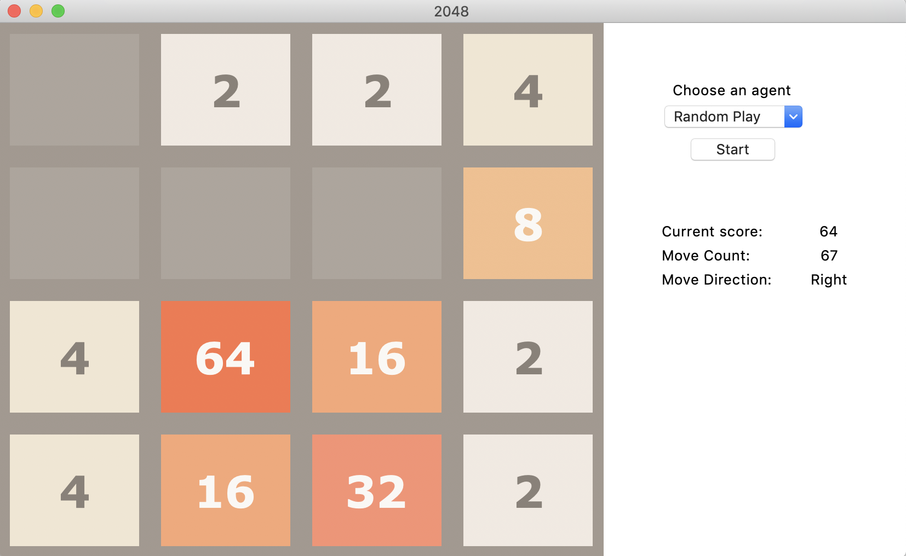

## Setup instructions

### To create and use environment with required libaries

```bash
conda env create -f environment.yml

conda activate game2048
```
### Run the GUI
```
In terminal:
1. navigate to root folder
2. python3 main.py
```

### Interacting with the GUI
1. Select `START` to start simulation with the selected agent/model.
2. Use the dropdown menu to select another agent/model.
3. Upon a new selection, the game grid will reset.
4. The `START/STOP` button allows you to pause and play the simulation.

## Models / Agents
Agent options to run 2048 simulation on:
- Random play: random choice of action taken at every state
- Expectimax Search
- Score-based Monte Carlo (greedy & epsilon-greedy): based on score
- Moves-based Monte Carlo (greedy & epsilon-greedy): based on number of moves
- DQN

## Results
These states are shown on the GUI as the simulation is running:
- Current score = current highest tile value
- Move count = number of moves made so far
- Move direction = most recent direction moved / action taken by the player
